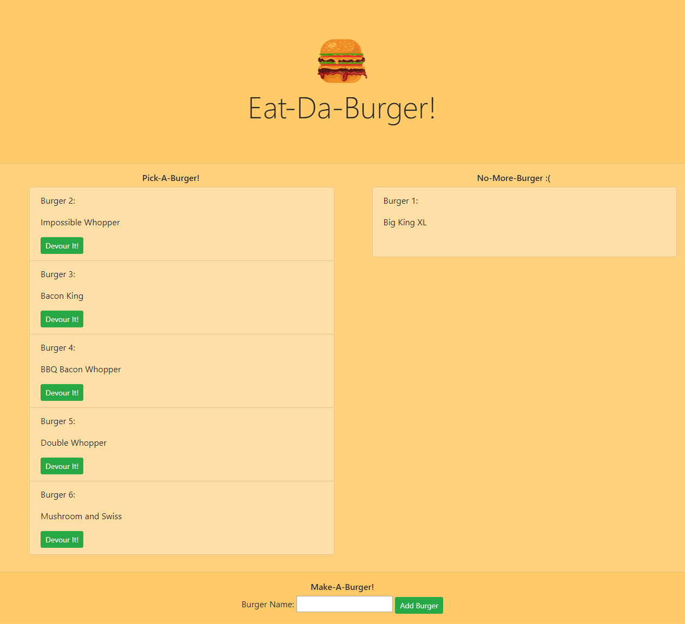
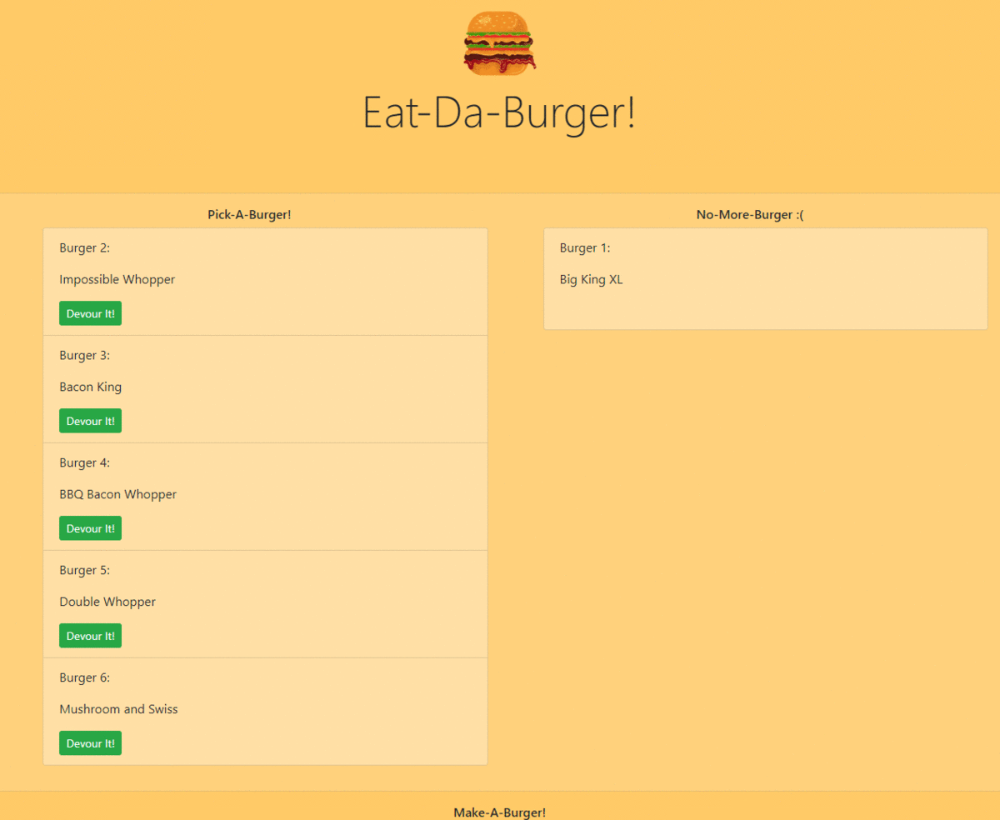

# GT-Homework-13-Node-Express-Handlebars

Eat-Da-Burger! An interactive app where burgers can be added to a menu, and then selected from the menu for eating!



## Description

Eat-Da-Burger! is a restaurant app that lets users input the names of burgers they'd like to eat. Whenever a user submits a burger's name, your app will display the burger on the left side of the page -- waiting to be devoured. Each burger in the waiting area also has a `Devour it!` button. When the user clicks it, the burger will move to the right side of the page. Your app will store every burger in a database, whether devoured or not.

## Table of Contents

* [Installation](#installation)
* [Usage](#usage)
* [Design](#design)
* [Contributing](#contributing)
* [Website](#website)
* [Repository](#repository)
* [Questions](#questions)
* [License](#license)

## Installation

Install the necessary dependencies in the command line with:

```sh
npm install
```

## Usage

Option 1) Go to the provided <a href="https://immense-peak-43329.herokuapp.com/">link</a> to experience the website or,

Option 2) download and install MySQL Server and MySQL Workbench and build your own database to use wth the application. 

If use want to run the app on your own machine, first clone the repository to your system, then follow the above installation step(s), then setup your database for use with the application by copying the `schema.sql` file from the `db` folder and pasting the contents into the MySql Workbench query pane and running the script with the 'lightning bolt' icon. Then copy the contents from the `seeds.sql` file and running those scripts in the workbench query pane.

Ensure that your MySQL root password is set in the `connection.js` file housed in `config` folder.

Run the application in the command line with:

```sh
node server.js
```

Note: if the above command throws an error, make sure the file is first being targeted by running the command within the root of the project folder.


The following demonstrates general application functionality:



## Contributing

None.

## Website

[Deployed Application](https://immense-peak-43329.herokuapp.com/)

## Repository

[Github Repository](https://github.com/AlanAshworth/GT-Homework-13-Node-Express-Handlebars)

## Questions


Contact me at <a href="mailto:awashworth927@gmail.com">awashworth927@gmail.com</a>

     

<a href="https://github.com/SamSherrill">SamSherrill</a>  <a href="https://github.com/jessie-computes">jessie-computes</a>

<a href="https://github.com/drospond">drospond</a>

<a href="https://github.com/AlanAshworth">AlanAshworth</a>

## License

© 2019 Trilogy Education Services, a 2U, Inc. brand. All Rights Reserved.
